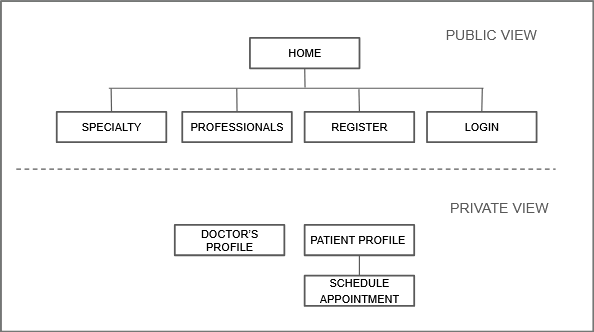

# Navigation Between Views

The getHealth application defines two groups of views: public views and private views.

## Public Views

Public views can be accessed without authentication.

- Home
- Specialties
- Professionals
- Register
- Login

## Private Views

Private views require the user to be authenticated.

- Doctor's Profile
- Patient Profile
- Schedule Appointment

## Navigation Flow

The following diagram represents the navigation structure between the public and private views.

