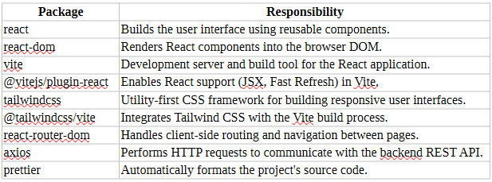
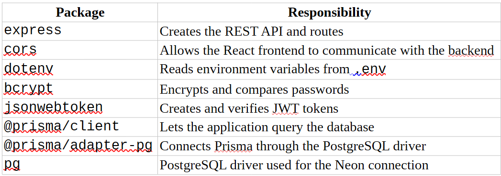

# Setup Guide

This guide explains how to install and configure the getHealth project locally.

## Prerequisites

Make sure the following tools are installed:

- Node.js
- npm
- Git

## Frontend Setup

The frontend is built with React and Vite.

The complete frontend installation process and its dependencies are documented below.

### Frontend Installation Reference

## Backend Setup

The backend is built with Node.js and Express.

The complete backend installation process and its dependencies are documented below.

### Backend Installation Reference

