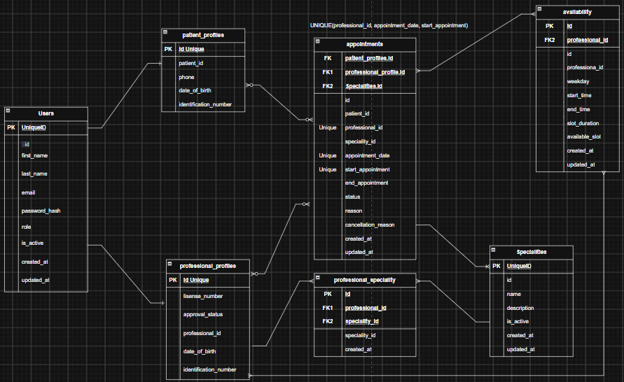

# THREE:

## TECHNOLOGIES:

### Frontend
- React
- React Router
- Tailwind CSS
- Axios

### Backend
- Node.js
- Express
- Prisma ORM
- PostgreSQL on Neon

## DEPENDENCIES:

### Authentication
- JWT
- bcrypt

### Utilities
- dotenv
- cors
- nodemon

## NPM FRONTEND INSTALLATION:

npm create vite@latest 
npm install
npm install tailwindcss @tailwindcss/vite
npm install react-router-dom@latest  OR npm install react-router-dom@7.11.0 
npm install axios 

## NPM BACKEND INSTALLATION:

npm init -y
npm install express
npm install cors
npm install dotenv
npm install bcrypt
npm install @prisma/client
npm install @prisma/adapter-pg
npm install pg

Development Dependencies:

npm install -D nodemon prisma 
npm install -D prettier 

# FOURTH:

## Tables:

#### specialties:
- id
- name
- description
- is_active
- created_at
- updated_at

#### professional_specialties:
- id
- professional_id
- specialty_id
- created_at

#### Patient_profiles Table:
- id
- user_id
- phone
- date_of_birth
- identification_number

#### Professional_profiles Table:
- id
- user_id
- license_number
- biography
- approval_status

#### Availabilities Table:
- id
- professional_id
- weekday
- start_time
- end_time
- slot_duration
- available_slot
- created_at
- updated_at

#### Appointment Table:

- id
- patient_id
- professional_id
- specialty_id
- appointment_date
- start_time
- end_time
- status
- reason
- cancellation_reason
- created_at
- updated_at

#### Users Table:
- id            
- first_name
- last_name
- email
- password_hash
- role
- is_active
- created_at
- updated_at

# FIFTH:

## API Contract

The complete REST API contract is available here:
[View the complete API Contract](./00-getHealth-Resources/API-Contract.md)

### Authentication:

- POST /api/auth/register/patient
- POST /api/auth/register/professional
- POST /api/auth/login
- GET  /api/auth/profile

### Specialities:

- GET    /api/specialties
- GET    /api/specialties/:id
- POST   /api/specialties
- PUT    /api/specialties/:id
- PATCH /api/specialties/:id/status

### Professionals:

- GET   /api/professionals
- GET   /api/professionals/:id
- PATCH /api/professionals/:id
- PATCH /api/professionals/:id/status

- POST /api/professionals/:id/specialties
- DELETE /api/professionals/:id/specialties/:specialtyId 

### Availavility:

- GET    /api/professionals/:id/availability
- POST   /api/professionals/:id/availability
- PUT    /api/availability/:id
- DELETE /api/availability/:id

- GET /api/professionals/:id/available-slots(This is going to be to incorporate the calendar)

### Appointments:

- POST   /api/appointments
- GET    /api/appointments/me
- GET    /api/appointments/:id
- PATCH  /api/appointments/:id/reschedule
- PATCH  /api/appointments/:id/cancel
- PATCH  /api/appointments/:id/status

